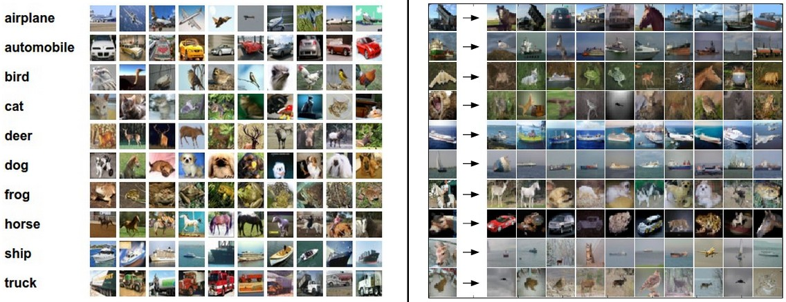

# 1. Course Introduction
[From Neuroscience To Computer Vision](https://towardsdatascience.com/from-neuroscience-to-computer-vision-e86a4dea3574)
<b>To do:</b>
Update Important Points

# Image Classification
## 1. Data-Driven Approach
1. Collect a dataset of images and labels
2. Use Machine Learning to train a classifier
3. Evaluate the classifier on new images

```python
def train(images, labels):
  #Machine learning!
  return model

def predict(model, images):
  #Use model to predict labels
  return test_labels
```

When it comes to dataset, these API are change a bit(train and test dataset),

```python
def train(train_images, labels):
  #Machine learning!
  return model

def predict(model, test_images):
  #Use model to predict labels
  return test_labels
```

## 2 . Nearest Neighbor Classifier
The nearest neighbor classifier will take a test image, compare it to every single one of the training images, and predict the label of the closest training image. 


Given two images and representing them as vectors I1,I2 , a reasonable choice for comparing them might be the L1 distance:
$$ d1(I1,I2)= \sum_{p}|IP1 - IP2| $$

Where the sum is taken over all pixels. Here is the procedure visualized:

